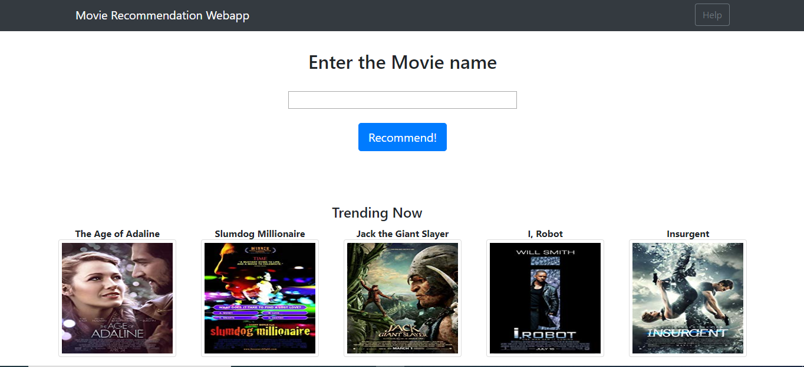
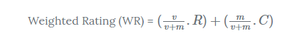
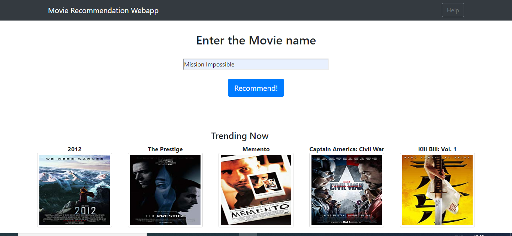
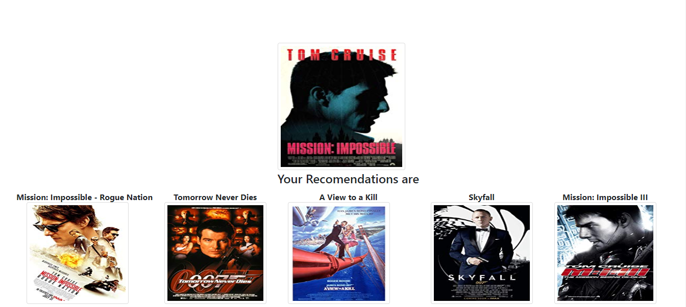

<h1>Objective</h1> 
This is a simple movie Recommendation webapp using flask web framework. In this I have used content based filtering and Demographic filtering. 

<h1>Description</h1>
The rapid growth of data collection has led to a new era of information. Data is being used to create more efficient systems and this is where Recommendation Systems come into play. Recommendation Systems are a type of information filtering systems as they improve the quality of search results and provides items that are more relevant to the search item or are realted to the search history of the user.

They are used to predict the rating or preference that a user would give to an item. Almost every major tech company has applied them in some form or the other: Amazon uses it to suggest products to customers, YouTube uses it to decide which video to play next on autoplay, and Facebook uses it to recommend pages to like and people to follow. Moreover, companies like Netflix and Spotify depend highly on the effectiveness of their recommendation engines for their business and sucees.

In this project , I have used two recommendation systems:- 
<b>1) Demographic Filtering-</b> They offer generalized recommendations to every user, based on movie popularity and/or genre. The System recommends the same movies to users with similar demographic features. Since each user is different , this approach is considered to be too simple. The basic idea behind this system is that movies that are more popular and critically acclaimed will have a higher probability of being liked by the average audience.
  
<b>2) Content Based Filtering-</b> They suggest similar items based on a particular item. This system uses item metadata, such as genre, director, description, actors, etc. for movies, to make these recommendations. The general idea behind these recommender systems is that if a person liked a particular item, he or she will also like an item that is similar to it.
 
 In this project it takes input from the text field then it searches the movie name in the database,then extract the movie vector and then compare the particular movie vector with other movie vectors using cosine similarity.
The top 5 recommendations results is diplayed on screen.
Similarly for Top trending movies I have used followning approach.
 Calculate the score for every movie
 Sort the scores and recommend the best rated movie to the users.
 We can use the average ratings of the movie as the score but using this won't be fair enough since a movie with 8.9 average rating and only 3 votes cannot be considered better than the movie with 7.8 as as average rating but 40 votes. So, I'll be using IMDB's weighted rating (wr) which is given as :-

 where,
 v is the number of votes for the movie;
 m is the minimum votes required to be listed in the chart;
 R is the average rating of the movie; And
 C is the mean vote across the whole report
<h1>Results</h1>

A small <b>VIDEO</b> demo that will demonstrate the working is :-

